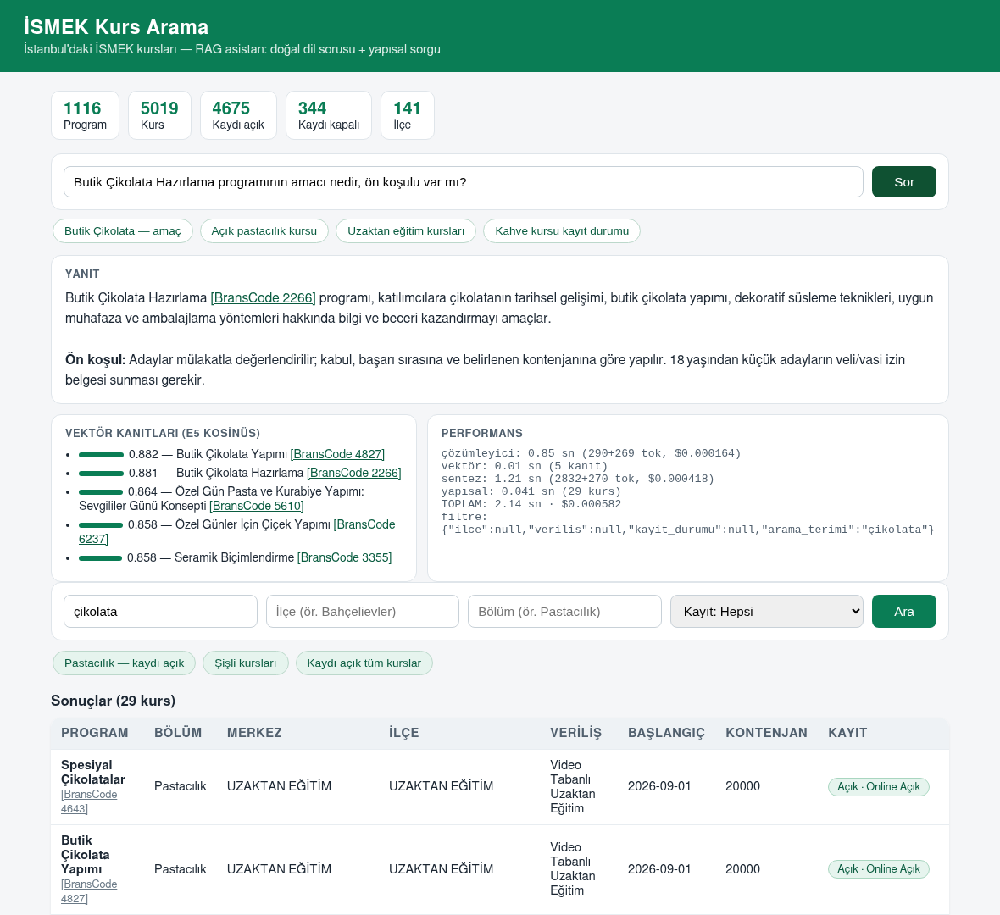
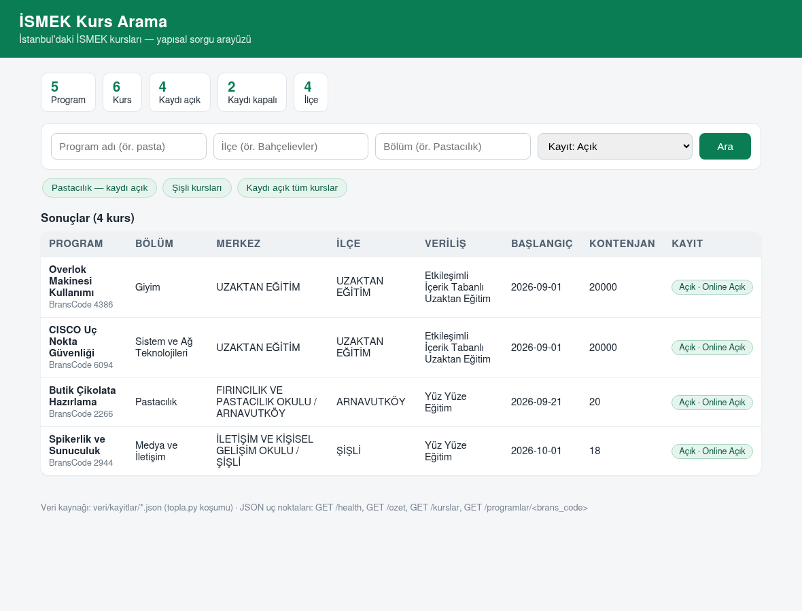

# Ismek Asistan

İSMEK kursları hakkında bilgi almak isteyen kişiler için geliştirilen asistan projesi.

İstanbul'da ücretsiz sanat ve meslek eğitimi veren İSMEK kurslarını aramak, karşılaştırmak ve kişiye uygun kursları önermek için kullanılır. Kullanıcı sorularını doğal dilde yanıtlar; kurs isimleri, dalları ve eğitim yerleri hakkında güncel bilgi sağlar.

## 2. Gün

Projenin iki bileşeni bu gün depoya eklendi:

- **`app/`** — FastAPI tabanlı sorgu API'si.
  - `app/sorgu.py`: `veri/kayitlar/*.json` kayıtlarını yükler; ilçe, kayıt durumu, bölüm, veriliş ve arama filtreleriyle yapısal sorgu (`sorgula`), koşum istatistiği (`istatistik`) ve `ozet.json` ↔ `kayitlar` tutarlılık kapısı (`dogrulama_kapisi`) sunar.
  - `app/api.py`: uç noktalar `GET /health`, `GET /ozet`, `GET /kurslar` ve `GET /programlar/{brans_code}`. Çalıştırma (repo kökünden): `uvicorn app.api:app --port 8000`
  - `requirements.txt`: fastapi, uvicorn, httpx, pytest.
  - `Dockerfile`: `docker build -f app/Dockerfile -t ismek-sunucu .` (repo kökünden koş; context repo kökü olmalı) → sonra `docker run -d -p 8000:8000 ismek-sunucu`. `ISMEK_VERI_DIR=/ismek/veri` image içinde sabitli. Gün 3 ile image RAG bağımlılıklarını (torch-CPU, chromadb, sentence-transformers) ve `veri/markdown` belgelerini de içerir; ilk açılışta e5 modeli (~450 MB) Hugging Face'ten iner.
- **`veri/`** — `topla.py` çıktısı veri katmanı: `kayitlar/*.json` (1116 program / 5019 kurs — İSMEK'in tam aktif kataloğu, 2026-09-04 koşumu; tek doğruluk kaynağı), koşum özeti `ozet.json` ve lab/CI için sabit fixture `ornek/` (5 program, 6 kurs — `ISMEK_VERI_DIR=veri/ornek`).


## 3. Gün

Doğal dil sorusu → kanıtlı yanıt hattı (RAG) ve web arayüzü eklendi:

- **`bot/`** — RAG motoru:
  - `bot/istemci.py`: çok sağlayıcı ücretsiz LLM hattı (Groq > HF > Gemini; 402/429'da sıradakine geçer) + token/maliyet muhasebesi.
  - `bot/sorgu_cozumleyici.py`: Türkçe soru → JSON filtre. Guardrail: LLM çıktısı kullanıcıya içerik olarak gösterilmez, yalnız yapısal sorguya parametre olur.
  - `bot/rag.py`: e5 (`multilingual-e5-small`) vektör araması — ChromaDB üzerinde `veri/markdown/*.md` statik belgeleri (`passage: ` / `query: ` prefix kuralıyla) — ve kanıtlı LLM sentezi.
  - Yanıt tonu: samimi ve yardımsever — aranan kurs veride yoksa günlük dille söylenir; alternatif yalnızca sorunun konusuyla gerçekten ilgiliyse önerilir, ilgisizse İSMEK portalına (enstitu.ibb.istanbul) yönlendirilir. Uydurma yasağı aynen geçerli.
  - `bot/requirements.txt`: openai, sentence-transformers, chromadb, pytest.
- **`topla.py`** — İSMEK portalının PageMethods JSON API'sinden tam katalogu toplayan nazik toplayıcı (kayitlar + markdown + ozet üretir; devam edebilir, `python3 topla.py`). RAG'ın statik belgeleri (`veri/markdown/*.md`: amaç, ön koşullar, sınav, malzeme) bu koşumdan gelir; kayıt durumu/tarih gibi dinamik alanlar bilinçli olarak belgeye konmaz — onlar `app/sorgu.py` yapısal katmanından gelir.
- **`app/api.py`** — yeni `POST /api/soru`: çözümleyici → yapısal sorgu + vektör arama → sentez; aşama süreleri, token ve maliyet dökümüyle döner. `GET /health` artık program sayısı + model adı verir.
- **`app/web.py`** — tek sayfa arayüz: doğal dil soru kutusu + örnek soru çipleri (yanıt, vektör kanıt skorları, performans/filtre paneli) ve yapısal filtre formu. Derin bağlantı: `/?soru=...` (RAG) veya `/?kayit=acik` (yapısal).
- **`app/sorgu.py`** — `arama` filtresi artık program ve bölüm adında substring eşleşir (çözümleyici "pastacılık" gibi bölüm adı döndürünce de satır döner) ve şapkalı harf duyarsızdır ("zeka" ↔ "Zekâ").

Çalıştırma (repo kökünden, LLM için `GROQ_API_KEY` env'de):

```
python3 topla.py                    # (isteğe bağlı) veriyi tazele: kayitlar + markdown + ozet
python3 bot/rag.py --kur             # bir kez: vektör indeksini kur
uvicorn app.api:app --port 8000      # http://127.0.0.1:8000
```

Veride olmayan bir kurs sorulduğunda asistan uydurmaz; günlük dille söyler ve alternatif önerir:

> **Soru:** "Linux kursu var mi?" → **Yanıt:** "Şu an veri tabanımızda Linux kursu bulunmuyor. İlginizi çekebilecek bazı benzer eğitimlerimiz var: **CISCO Uç Nokta Güvenliği** [BransCode 6094] — ağ ve güvenlik temelleri, **Overlok Makinesi Kullanımı** [BransCode 4386] — kısa ve pratik bir uzaktan eğitim, ..."

Örnek sorgu sonucu — "Butik Çikolata Hazırlama programının amacı nedir, ön koşulu var mı?": yanıt, e5 kanıt skorları ve aşama performansı:



Yapısal filtre arayüzü — "Kaydı açık tüm kurslar" çipi (4 kurs):



**Katki Saglayanlar:**
- Muhammet Ozturk
- Furkan Kurt
- Bekir Yildirim
